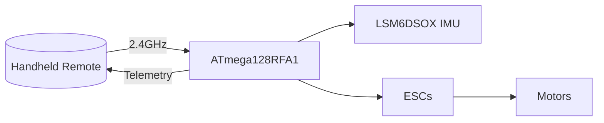
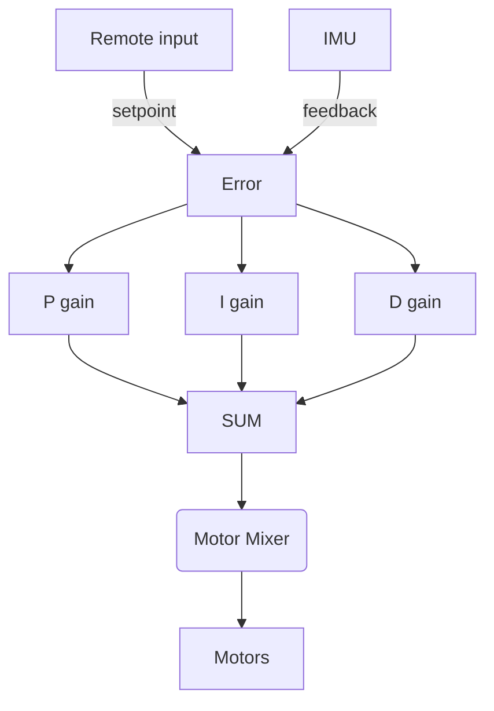

# Quadcopter

This project contains hardware and firmware for a custom 4‑rotor UAV. The design is based on the ATmega128RFA1 microcontroller which integrates a 2.4 GHz radio. The repository includes the printed circuit board layout, flight controller firmware, and code for a handheld remote.

## System Overview

The project consists of two main pieces of hardware:

1. **Quadcopter** – a compact flight controller board driving four brushless motors via electronic speed controllers (ESCs).
2. **Remote** – a handheld transmitter with gimbal sticks, buttons and an LCD that sends pilot commands over 2.4 GHz.

The diagram below summarizes the high–level flow of data and control.



## Repository Layout

```
firmware/              Embedded source code and Arduino libraries
hardware/              EAGLE schematic/board files and CAM outputs
```

Key firmware sketches:

- `quad_flight/quad_flight.ino` – flight controller running on the quadcopter
- `remote_firmware/remote_firmware.ino` – transmitter with LCD and gimbals

## Hardware Overview

The quadcopter PCB is a four‑layer board measuring 119×119 mm with red soldermask and white silkscreen【F:hardware/metadata.txt†L1-L4】. Major components:

- **ATmega128RFA1** MCU with onboard 2.4 GHz transceiver
- **LSM6DSOX** IMU for 3‑axis gyro and accelerometer
- FET motor drivers for four brushless ESCs
- Power regulation, battery monitor (via `BAT_SENSE_PIN`), and status LEDs
- Connectors for an external receiver and programming headers

EAGLE design files are under `hardware/` and the manufacturing CAM outputs are zipped as `quadcopter.cam.zip`.

The `hardware/QuadClass_Atmega128RFA_Arduino_Addon` folder contains board definitions so the Arduino IDE can program the ATmega128RFA1 board. Copy this directory into the `hardware` folder of your Arduino sketchbook to install the board support.

## Firmware Overview

### Wireless Protocol

The on-board radio communicates with the remote using packets defined in `Wireless_Packet.h`:

```cpp
struct Packet {
    uint8_t magicNumber;
    uint8_t roll, pitch, yaw, throttle;
    double  Kp_pitch, Ki_pitch, Kd_pitch;
    double  Kp_roll,  Ki_roll,  Kd_roll;
    double  Kp_yaw,   Ki_yaw,   Kd_yaw;
    uint8_t batteryVoltage;
    int     trims[3];
    uint8_t state;
    uint8_t checksum;
};
```
【F:firmware/libraries/Wireless_Packet/Wireless_Packet.h†L1-L34】

Packets carry user commands, PID gains, trims, and telemetry such as battery level. Communication occurs on channel&nbsp;20 by default.

### Flight Controller (`quad_flight.ino`)

The flight controller reads the LSM6DSOX IMU using the Adafruit AHRS library. A complementary filter and PID loop produce motor outputs:

- Desired roll/pitch/yaw are received from the remote.
- IMU data is converted to angles and rates.
- Proportional, integral and derivative terms are computed every loop.
- Four PWM outputs drive the motors via `spinMotors()` which mixes PID outputs to each rotor.

State transitions (`DISARMED`, `ARMED`, `QUAD_RESET`) are received wirelessly. The code also reports back battery percentage every second.

### Remote Firmware (`remote_firmware.ino`)

The remote uses analog gimbals, push buttons, a rotary encoder and a SerLCD display. It calibrates the joystick range to map raw ADC values to 0–255 and stores them in EEPROM【F:firmware/remote_firmware/remote_firmware.ino†L240-L314】. In the armed state, pressing the encoder or buttons adjusts trim values which are sent in each packet.

Incoming packets from the quad provide its state and battery status so the remote can display feedback to the user.

The remote hardware exposes the following controls:

- Two gimbal sticks (yaw/throttle and roll/pitch) wired to analog inputs A0–A3.
- A rotary encoder with push‑button for menu navigation.
- Five directional buttons for trims and menu actions.
- A small serial LCD showing mode and battery levels.

All pins are defined in `quad_remote.h` under the `Remote` library.

### PID Control Loops

The flight controller stabilizes the aircraft using three independent PID loops
for roll, pitch and yaw. Error values are computed from the difference between
the desired setpoint (received from the remote) and the measured angle or rate
from the IMU. Each loop produces a correction that is mixed into the individual
motor commands.



## Building and Uploading

1. Install the Arduino IDE.
2. Copy `firmware/hardware/QuadClass_Atmega128RFA_Arduino_Addon` to your Arduino `hardware/` directory and restart the IDE. Select **Quad Class ATmega128RFA1 Boards** under *Tools → Board*.
3. Copy the libraries from `firmware/libraries` into your Arduino `libraries/` directory.
4. Open `firmware/quad_flight/quad_flight.ino` to build the flight controller or `firmware/remote_firmware/remote_firmware.ino` for the remote.
5. Connect the ATmega128RFA1 board via USB and upload using the standard Arduino bootloader.

## License

This project is released under the MIT License; see [LICENSE](LICENSE) for details.

## References

- [NVSL QuadClass Resources](https://github.com/NVSL/QuadClass-Resources/tree/master)
