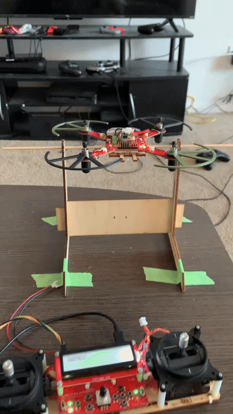
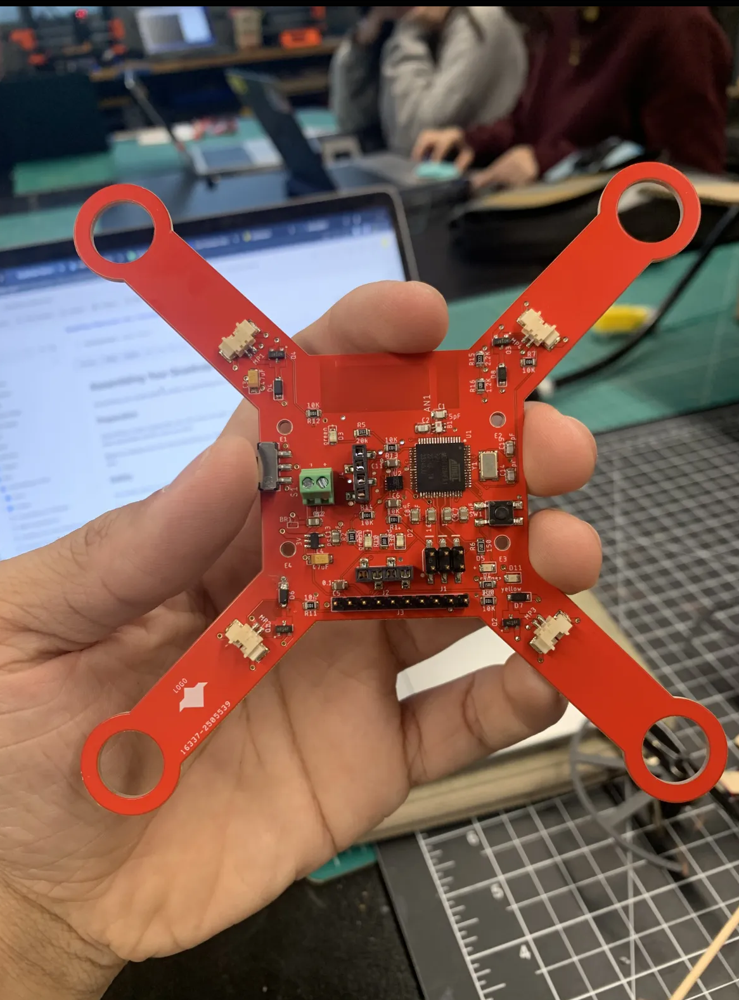
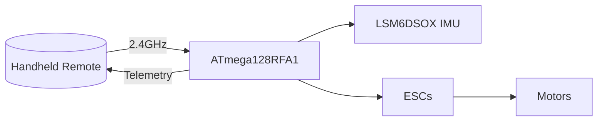
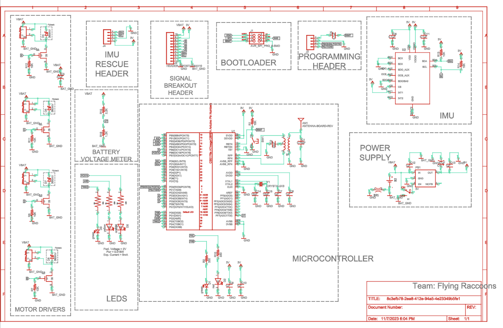
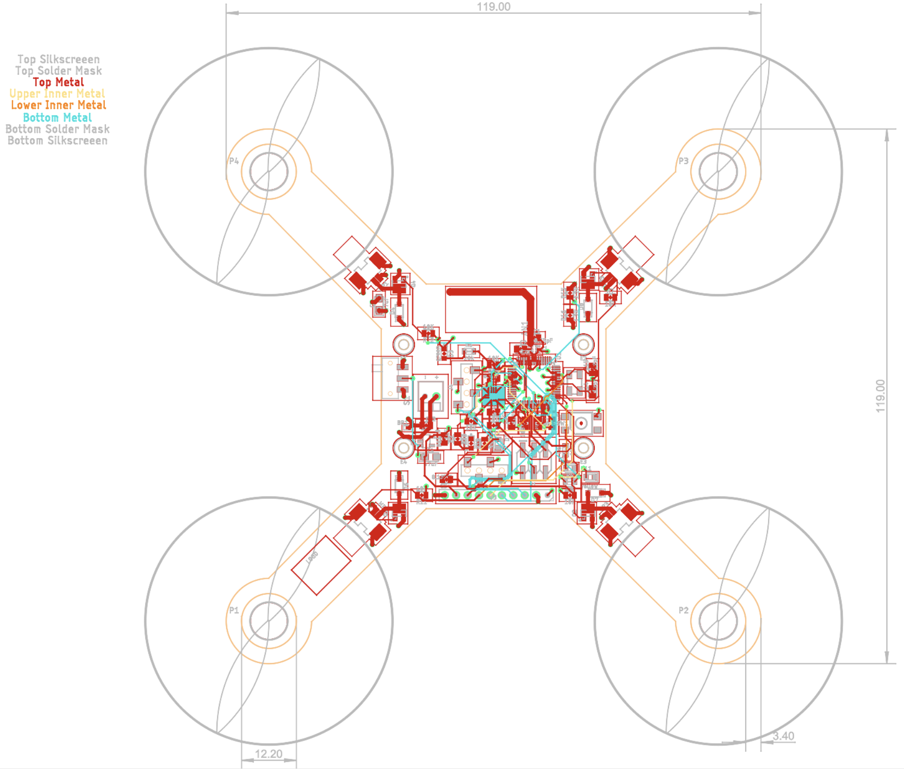
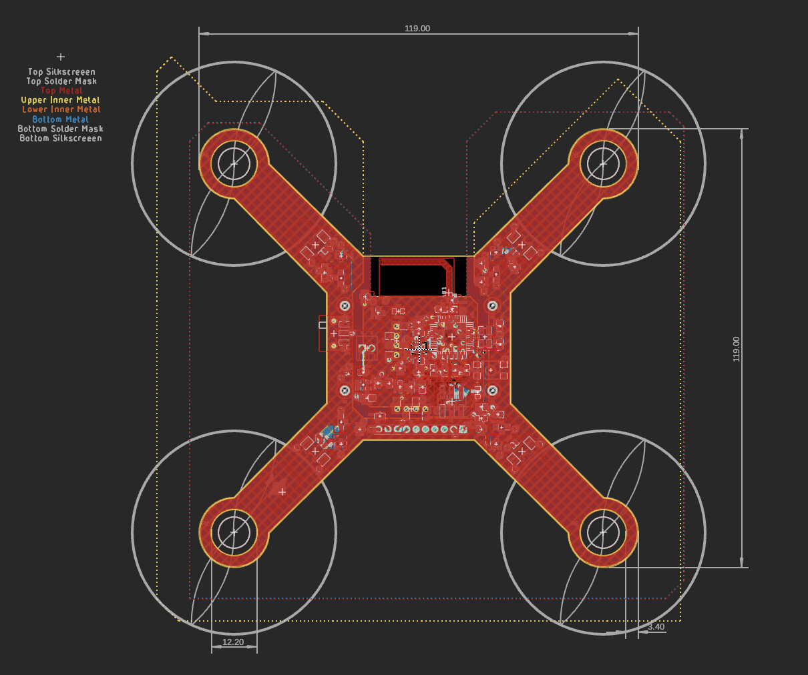
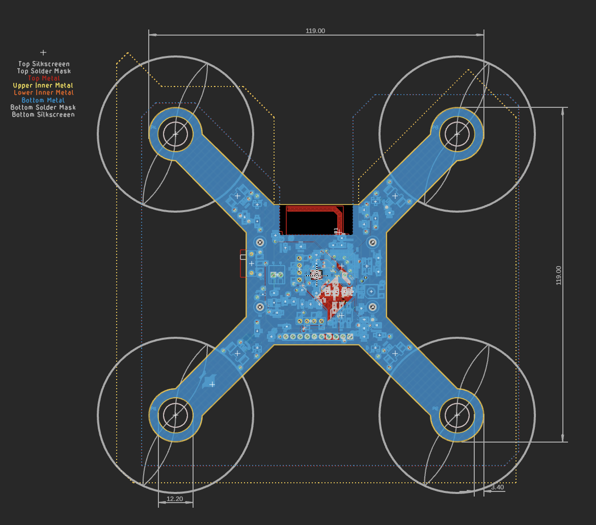
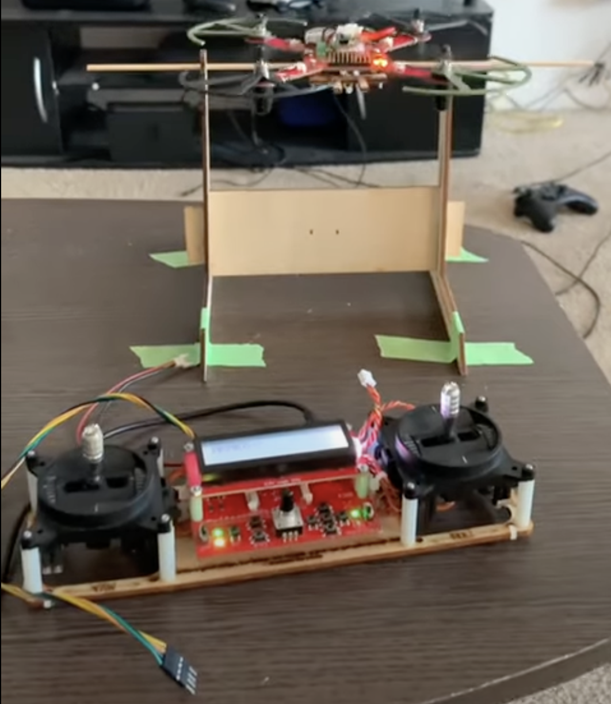
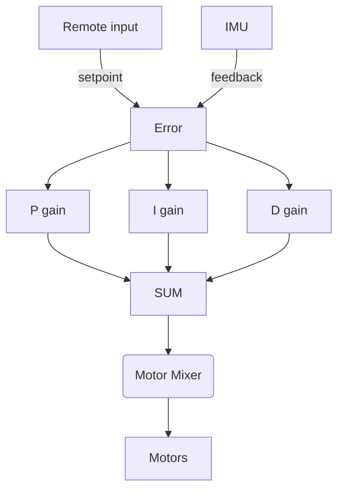
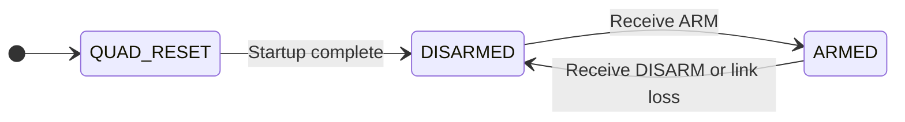

# Quadcopter

*Made by Girish Krishnan and Anish Kulkarni*

---

Hardware and firmware for a compact 4‑rotor UAV.
[**Watch the demo videos on YouTube!**](https://www.youtube.com/playlist?list=PLE_L-WPduPxbYMuvPQKa1v5fUpK1VIxrP)

|| |
|---|---|

This project contains hardware and firmware for a custom 4‑rotor UAV. The design is based on the ATmega128RFA1 microcontroller which integrates a 2.4 GHz radio. The repository includes the printed circuit board layout, flight controller firmware, and code for a handheld remote.

**Note**: The specific code files and CAD files are currently private, but you can contact me for more details.

## Table of Contents
- [Quadcopter](#quadcopter)
  - [Table of Contents](#table-of-contents)
  - [Features](#features)
  - [System Overview](#system-overview)
  - [Hardware Overview](#hardware-overview)
  - [Firmware Overview](#firmware-overview)
    - [Wireless Protocol](#wireless-protocol)
    - [Flight Controller](#flight-controller)
    - [Remote Firmware](#remote-firmware)
    - [PID Control Loops](#pid-control-loops)
    - [State Machines](#state-machines)
      - [Quadcopter](#quadcopter-1)
      - [Remote](#remote)
  - [Building and Uploading](#building-and-uploading)

## Features
- Flight controller based on the ATmega128RFA1 with integrated 2.4 GHz radio
- Handheld remote with dual gimbals, LCD and menu navigation
- Telemetry link for battery monitoring and state feedback
- PID tuning directly from the remote
- Four-layer PCB with on-board ESC drivers and IMU

## System Overview

The project consists of two main pieces of hardware:

1. **Quadcopter** – a compact flight controller board driving four brushless motors via electronic speed controllers (ESCs).
2. **Remote** – a handheld transmitter with gimbal sticks, buttons and an LCD that sends pilot commands over 2.4 GHz.

The diagram below summarizes the high–level flow of data and control.


```mermaid
graph LR
    Remote[(Handheld Remote)] -- 2.4GHz --> MCU[ATmega128RFA1]
    MCU --> IMU[LSM6DSOX IMU]
    MCU --> ESCs
    ESCs --> Motors
    MCU -- Telemetry --> Remote
```

## Hardware Overview

The quadcopter PCB is a four‑layer board measuring 119×119 mm with red soldermask and white silkscreen. Major components:

- **ATmega128RFA1** MCU with onboard 2.4 GHz transceiver
- **LSM6DSOX** IMU for 3‑axis gyro and accelerometer
- FET motor drivers for four brushless ESCs
- Power regulation, battery monitor (via `BAT_SENSE_PIN`), and status LEDs
- Connectors for an external receiver and programming headers

Here is a schematic overview of the quadcopter:



Here is the layout of the quadcopter PCB, showing the placement of components and routing:



Here are pictures of the top and bottom layers of the PCB:

|||
|---|---|
| Top Layer | Bottom Layer |

## Firmware Overview

### Wireless Protocol

The on-board radio communicates with the remote using packets. Packets carry user commands, PID gains, trims, and telemetry such as battery level.

### Flight Controller

The flight controller reads the LSM6DSOX IMU using the Adafruit AHRS library. A complementary filter and PID loop produce motor outputs:

- Desired roll/pitch/yaw are received from the remote.
- IMU data is converted to angles and rates.
- Proportional, integral and derivative terms are computed every loop.
- Four PWM outputs drive the motors which mixes PID outputs to each rotor.

State transitions are received wirelessly. The code also reports back battery percentage every second.

### Remote Firmware

The remote uses analog gimbals, push buttons, a rotary encoder and a SerLCD display. It calibrates the joystick range to map raw ADC values to 0–255 and stores them in EEPROM. In the armed state, pressing the encoder or buttons adjusts trim values which are sent in each packet.

Incoming packets from the quad provide its state and battery status so the remote can display feedback to the user.

The remote hardware exposes the following controls:

- Two gimbal sticks (yaw/throttle and roll/pitch) wired to analog inputs A0–A3.
- A rotary encoder with push‑button for menu navigation.
- Five directional buttons for trims and menu actions.
- A small serial LCD showing mode and battery levels.

### PID Control Loops

Here is the setup used for tuning the PID for the roll and pitch axes:



The flight controller stabilizes the aircraft using three independent PID loops
for roll, pitch and yaw. Error values are computed from the difference between
the desired setpoint (received from the remote) and the measured angle or rate
from the IMU. Each loop produces a correction that is mixed into the individual
motor commands.


```mermaid
graph TD
    R[Remote input] -->|setpoint| E[Error]
    IMU -- feedback --> E
    E --> P[P gain]
    E --> I[I gain]
    E --> D[D gain]
    P --> SUM
    I --> SUM
    D --> SUM
    SUM --> MIX(Motor Mixer)
    MIX --> Motors
```

### State Machines
#### Quadcopter


```mermaid
stateDiagram-v2
    direction LR
    [*] --> QUAD_RESET
    QUAD_RESET --> DISARMED: Startup complete
    DISARMED --> ARMED: Receive ARM
    ARMED --> DISARMED: Receive DISARM or link loss
```

#### Remote

```mermaid
stateDiagram-v2
    direction LR
    [*] --> DISARMED
    DISARMED --> CALIBRATION: Center button
    CALIBRATION --> DISARMED: Save calibration
    DISARMED --> ARMED: Stick combo 3s
    ARMED --> DISARMED: Center button or QUAD_RESET from quad
 ```

## Building and Uploading

Follow the instructions in [NVSL QuadClass Resources](https://github.com/NVSL/QuadClass-Resources/tree/master) to get started.
